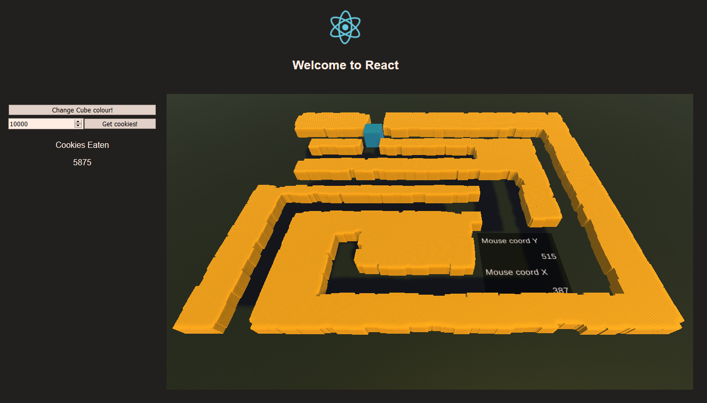
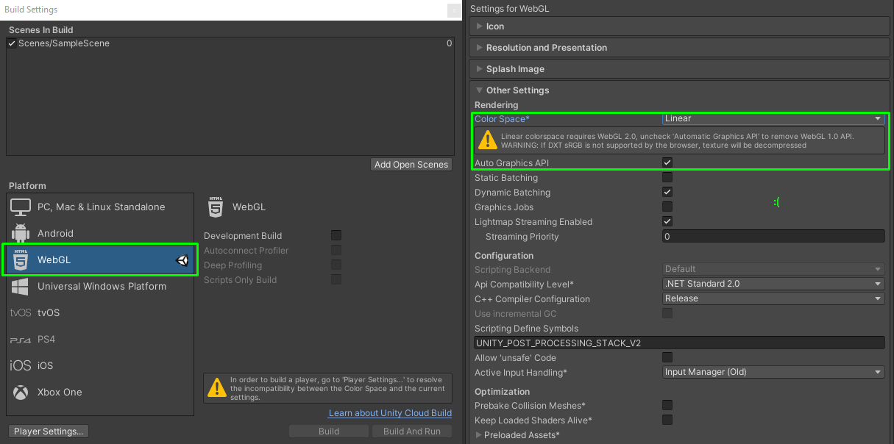
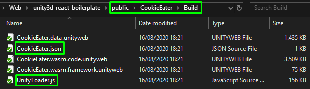
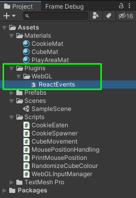

# Unity3D-React-Boilerplate

### 🦧 *please note i haven't been using neither react nor react-unity-webgl in a while so this thing is definitely heavily outdated, good luck!*

---



## TLDR; see result [_here_](https://unity3d-react-boilerplate.herokuapp.com/) 🐇


- Example project / tutorial for hosting Unity3D WebGL build as a static webpage on Heroku (using create-react-app).
- Using a super cool repo [react-unity-webgl](https://github.com/elraccoone/react-unity-webgl) by [@El Raccoone](https://github.com/elraccoone)
- Targetted especially for unity3d people who haven't hosted a webapp before.

## How to recreate

0. [How to run](#0.-how-to-run)
1. [Initial project setup](#1.-initial-project-setup)
2. [Build Unity project for WebGL](#2.-build-unity-project-for-webgl)
3. [Integrate Unity build into your react webapp](#3.-integrate-unity-build-into-your-react-webapp)
4. [Two-way communication](#4.-dash-two-way-communication)

## 0. How to run

You will need to have [yarn](https://github.com/yarnpkg/yarn) installed on your pc

    $ git clone https://github.com/mariaheine/unity3d-react-boilerplate.git
    $ yarn install
    $ yarn start

This will let you locally run example project.

## 1. Initial project setup

🌌 Follow the _Quick Start_ on this repo: [Heroku Buildpack for create-react-app](https://github.com/mars/create-react-app-buildpack#user-content-quick-start)
With just a few easy steps you end with a static, frontend-only web site hosted on Heroku.

To update the site by pushing changes to heroku remote:

    $ git commit -m "wow :o"
    $ yarn build
    $ git push heroku master

To open it:

    `$ heroku open`

> Wait what?? And just like that I have hosted a webpage? :cake: :wine_glass:

Your `package.json` should look something like this (no babel, no webpack config :see_no_evil:):

```json
{
  "name": "unity3d-react-boilerplate",
  "version": "0.1.0",
  "private": true,
  "dependencies": {
    "react": "^16.4.1",
    "react-dom": "^16.4.1",
    "react-scripts": "1.1.4"
  },
  "scripts": {
    "start": "react-scripts start",
    "build": "react-scripts build",
    "test": "react-scripts test --env=jsdom",
    "eject": "react-scripts eject"
  }
}
```

## 2. Build Unity project for WebGL

🌊 [Unity documentation concerning WebGL development](https://docs.unity3d.com/Manual/webgl-gettingstarted.html)

💧 Your build settings should look something like on the picture below, please pay special attention to:

- Setting build platform for WebGL
  - File -> Build Settings -> Platfrom -> WebGL
- ColorSpace
  - Changing it from `Gamma` to `Linear` will force you to use WebGL 2.0 which will unfortunately [break compatibility with Safari browsers](https://docs.unity3d.com/Manual/webgl-browsercompatibility.html) (as of 16/08/2020 for Safari 12.1), so you should
    probably keep using `Gamma`



- 🔎 Once building is finished, you should be most interested with a directory containing those files:



## 3. Integrate Unity build into your react webapp

- Add [react-unity-webgl](https://github.com/jeffreylanters/react-unity-webgl) into your project, _it's just so cool._

- Copy entire Unity build folder (mentioned above) into your `public` webapp folder.

- Replace your `App.js` with [quick start code](https://github.com/jeffreylanters/react-unity-webgl/wiki/Quick-Start-Guide) from react-unity-webgl

In case of this example project it would be just:

```js
import React from "react";
import Unity, { UnityContent } from "react-unity-webgl";

export class App extends React.Component {
  constructor(props) {
    super(props);
    this.unityContent = new UnityContent(
      "CookieEater/Build/CookieEater.json.json",
      "CookieEater/Build/UnityLoader.js"
    );
  }
  render() {
    return <Unity unityContent={this.unityContent} />;
  }
}
```

- 🌼 After these easy steps you should be ready to test your Unity webapp by simply running `$ yarn start` command in your console. Uploading to Heroku is just as easy using

## **And thats all there is! 🎉**

With barely 5 lines of code your Unity build is imported and served in your React app. Isn't that cool? :o

For more info about `<UnityContent/>` component check out [Mr. Lanters' github wiki](https://github.com/jeffreylanters/react-unity-webgl/wiki/Unity-Content)

## 3. React to Unity communication

---

1. 🌱 Calling Unity method with no parameters

You can now evoke any public method in your Unity project by sending a message to `unityContent` specifying:

a. A GameObject `name` that has a `MonoBehaviour` attached

b. A `name` of a `public method` within one of the attached MonoBehaviours

```javascript
this.unityContent.send(
  "FlyCube", // GameObject name
  "Randomize" // Public method name
);
```

2. 🌿 Calling Unity method with a single parameter

⚠️ This may only be a (single!) number or a string

```javascript
this.props.unityContent.send("PlayArea", "SpawnCube", 10);
```

⚠️ You cannot directly use template literals when passing a string. Write it first to a variable, then pass it instead.

```javascript
let mouseCoords = `${this.state.pageX} ${this.state.pageY}`;

if (this.state.isLoaded === true) {
  this.unityContent.send(
    "TextDisplayer",
    "UpdateDoubleMousePosition",
    mouseCoords
  );
}
```

3. 🌴 Calling a method with more than one parameter - possible workaround.

As mentioned above GameObject.SendMessage(), here as `this.unityContent.send(...)`, may only pass as value one argument that can be **either a number or a string**.

One possible workaround is passing multiple values in a string and then parsing it inside Unity method.

In above ⚠️ about template literals we passed two numeric coords inside `mouseCoords` string variable to a method `UpdateDoubleMousePosition` inside `TextDisplayer` GameObject. To interpret that string as two separate numbers in C#:

```c
public void UpdateDoubleMousePosition(string mouseCoords)
{
   string[] coords = mouseCoords.Split(' ');

   int[] coordsNumerical = new int[2];

   for(int i = 0; i < coords.Length; i++)
   {
      coordsNumerical[i] = Int32.Parse(coords[i]);
   }

   TextY.text = coords[0];
   TextX.text = coords[1];
}
```

## 4. Unity to React communication

---

3 steps for every single call:

0. pre: [creating .jslib plugin](#creating-.jslib-plugin)
1. [Creating javascript event handler](#Creating-javascript-event-handler)
2. [Adding the method binding to the .jslib script](#Adding-the-method-binding-to-the-.jslib-script)
3. [Importing and using the method binding in a unity c# script](#Importing-and-using-the-method-binding-in-a-unity-c#-script)

### Creating .jslib plugin
---
Create a text file in `Plugins` folder in your Unity project (the folder has to be named this way) and rename it to `howeveryouwant.jslib`,

<table>
  <tr>
    <td>
    
    </td>
    <td>
The empty base of that script should look like this:

```
mergeInto(LibraryManager.library, {

});
```
  </td>
  </tr>
</table>

### Creating javascript event handler
---

An example of `Score.js` from example project:
```js
props.unityContent.on("CookieEatenEvent", () => {
  this.setState((prevState) => ({
    cookiesEaten: prevState.cookiesEaten + 1,
  }));
});
```

### Adding the method binding to the .jslib script
---

```
mergeInto(LibraryManager.library, {

  CookieEatenEvent: function() {
    ReactUnityWebGL.CookieEatenEvent();
  }

});
```


### Importing and using the method binding in a unity c# script
---

From example project:

[Read more about Native plugins](https://docs.unity3d.com/Manual/NativePlugins.html)

```c
public class CookieEaten : MonoBehaviour {

    [DllImport("__Internal")]
    private static extern void CookieEatenEvent();

    void OnTriggerEnter(Collider col)
    {
        // -------------
        
        #if !UNITY_EDITOR && UNITY_WEBGL
            CookieEatenEvent();
        #endif
        Destroy(gameObject);
        
        // -------------
    }
}

```

Thats all, have fun! 🐇
